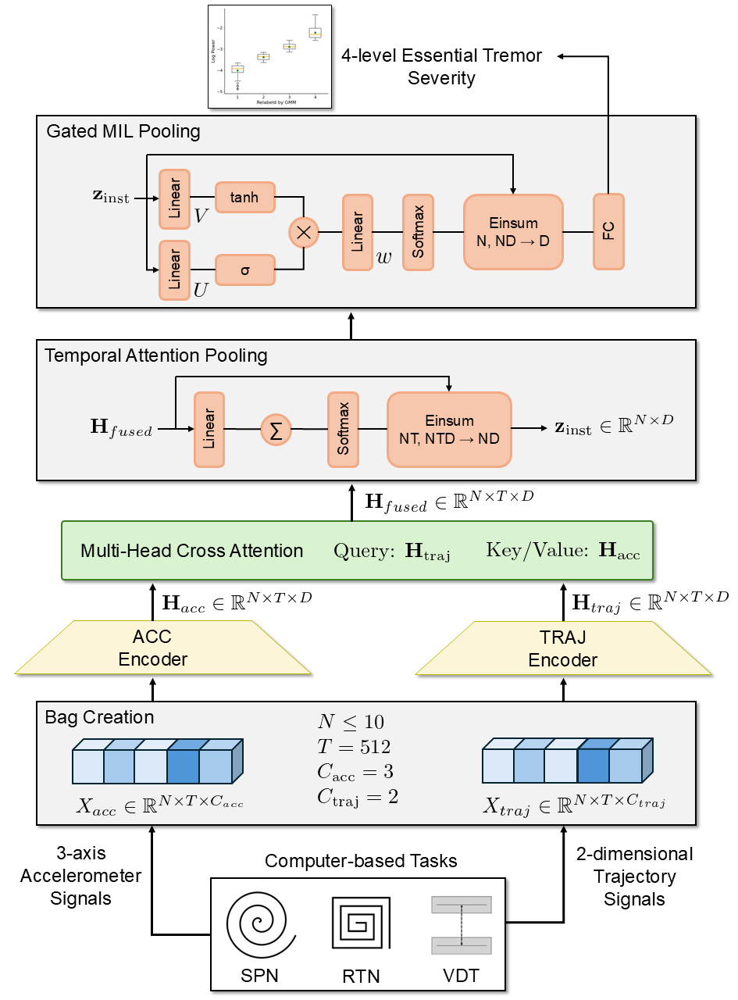

# Multimodal-ET-Severity-Assessment
This project includes data augmentation, model definition, training, inference, and analysis used in “Multimodal fusion network for essential tremor severity assessment using accelerometer and trajectory signals”

## Main.ipynb
- Model : LSTM, ResNet18, TimesNet, WaveNet-style, MIL_Multimodal, MIL_Single
- Dataset : Augmentation
- Functions for experiments : model builder, train functions, dataloader
- Train : training of multimodal and single modality models

## Table_and_Figure.ipynb
- load inference result files (.csv) and compute metrics (accuracy, weighted precision, weighted F1-score)
- generate tables and figures and perform the statistical analyses used in the paper

## Model structure

