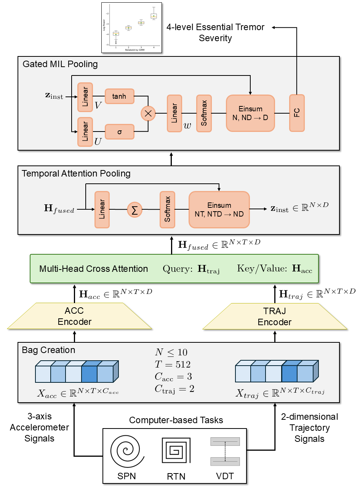

# Multimodal ET Severity Assessment

Training and analysis code for wearable-sensor assessment of essential tremor.

## Repository Layout

- `notebook/Main.ipynb`: single- and multimodal 9-fold LOSO-CV training
- `notebook/Table_and_Figure.ipynb`: prediction analysis and paper figures
- `src/et_severity/data`: manifest, segmentation, augmentation, and dataloaders
- `src/et_severity/models`: LSTM, ResNet18-1D, TimesNet, MyWaveNet, and MIL models
- `src/et_severity/training`: training engines and LOSO-CV orchestration
- `src/et_severity/analysis`: prediction metrics and table builders
- `src/et_severity/visualization`: plotting utilities

## Colab Setup

```python
!git clone https://github.com/12Gongsam/Multimodal-ET-Severity-Assessment.git
%cd Multimodal-ET-Severity-Assessment
!pip install -q -r requirements.txt
```

Raw data and labels should be available under:

```text
/content/data/
  relabel_md_k5.csv
  ... sensor CSV files referenced by the file column ...
```

Add the package source path:

```python
import sys
from pathlib import Path

REPO_ROOT = Path.cwd()
sys.path.insert(0, str(REPO_ROOT / "src"))
```

## Training

```python
from et_severity import (
    EncoderConfig,
    MultimodalModelConfig,
    SingleModelConfig,
    TrainingConfig,
    build_LOSO_loaders,
    build_manifest,
    run_loso_cv,
    set_seed,
)

SEED = 42
DATA_ROOT = Path("/content/data")
LABEL_CSV = DATA_ROOT / "relabel_md_k5.csv"

set_seed(SEED)
manifest = build_manifest(
    LABEL_CSV,
    DATA_ROOT,
    target_col="target_k5",
)

training_config = TrainingConfig(
    epochs=100,
    learning_rate=1e-3,
    weight_decay=1e-4,
    optimizer="adam",
    monitor="loss",
    early_stopping_patience=20,
    grad_clip=1.0,
    use_scheduler=True,
    scheduler_patience=5,
)
```

### Single Modality

```python
acc_loaders = build_LOSO_loaders(
    manifest,
    modality="acc",
    batch_size=16,
    target_per_class=200,
    seg_len=512,
    hop=512,
    num_workers=4,
)

single_config = SingleModelConfig(
    encoder=EncoderConfig(
        "LSTM",
        {
            "hidden_size": 128,
            "num_layers": 2,
            "dropout": 0.1,
        },
    ),
    num_classes=4,
    d_model=128,
    mil_attn_dim=64,
    seq_len=512,
)

acc_result = run_loso_cv(
    acc_loaders,
    modality="acc",
    target="severity",
    model_config=single_config,
    training_config=training_config,
    seed=SEED,
    expected_folds=9,
)

display(acc_result["fold_results"])
display(acc_result["fold_summary"])
```

For task classification, use `target="task"` and set `num_classes=3`.
Trajectory-only training uses `modality="traj"`.

### Multimodal

```python
multimodal_loaders = build_LOSO_loaders(
    manifest,
    modality="multimodal",
    batch_size=16,
    target_per_class=200,
    seg_len=512,
    hop=512,
    num_workers=4,
)

multimodal_config = MultimodalModelConfig(
    acc_encoder=EncoderConfig(
        "LSTM",
        {"hidden_size": 128, "num_layers": 2, "dropout": 0.1},
    ),
    traj_encoder=EncoderConfig(
        "ResNet18",
        {"feature_dim": 128},
    ),
    num_classes=4,
    d_model=128,
    cross_attention_heads=8,
    mil_attn_dim=64,
    time_pool="attn",
    seq_len=512,
)

multimodal_result = run_loso_cv(
    multimodal_loaders,
    modality="multimodal",
    model_config=multimodal_config,
    training_config=training_config,
    seed=SEED,
    expected_folds=9,
)
```

### Experimental Joint Instance Attention

This model pools each encoder over time, applies joint self-attention to the
`[ACC_1, ..., ACC_N, TRAJ_1, ..., TRAJ_N]` tokens, and then uses trajectory
tokens as cross-attention queries over ACC tokens.

```python
from et_severity import JointInstanceAttentionConfig

joint_config = JointInstanceAttentionConfig(
    acc_encoder=EncoderConfig(
        "LSTM",
        {"hidden_size": 128, "num_layers": 2, "dropout": 0.1},
    ),
    traj_encoder=EncoderConfig(
        "ResNet18",
        {"feature_dim": 128},
    ),
    num_classes=4,
    d_model=128,
    attention_heads=8,
    joint_attention_layers=2,  # 2 or 3
    feedforward_dim=512,
    attention_dropout=0.1,
    time_dropout=0.1,
    mil_attn_dim=64,
    seq_len=512,
)

joint_result = run_loso_cv(
    multimodal_loaders,
    modality="multimodal",
    model_config=joint_config,
    training_config=training_config,
    seed=SEED,
    expected_folds=9,
    checkpoint_dir=REPO_ROOT / "checkpoints" / "joint_instance_attention",
)

display(joint_result["fold_results"])
display(joint_result["fold_summary"])
```

For an existing Colab checkout, pull the updated repository and restart the
runtime before importing `et_severity` again:

```python
%cd /content/Multimodal-ET-Severity-Assessment
!git pull
```

## Metrics

`run_loso_cv()` calculates the same patient-level metrics as the legacy
analysis notebook:

- accuracy
- weighted precision (`precision_w`)
- weighted F1 (`f1_w`)

`fold_summary` contains the unweighted mean across the nine patients and the
sample standard deviation (`ddof=1`).

```python
display(multimodal_result["fold_summary"])
```

## Supported Encoders

- `LSTM`: `hidden_size`, `num_layers`, `dropout`
- `ResNet18`: `feature_dim`
- `TimesNet`: `feature_dim`, `seq_len`, `d_ff`, `e_layers`, `top_k`, `f_min`, `dropout`
- `MyWaveNet`: `residual_channels`, `skip_channels`, `dilations`, `n_stacks`

Encoder feature dimensions may differ from the MIL `d_model`; the model adds a
learned projection when necessary.

## Analysis

Open `notebook/Table_and_Figure.ipynb` and configure its data, prediction, and
figure directories. The notebook contains prediction summaries, patient-level
metrics, statistical comparisons, and paper figure generation.


